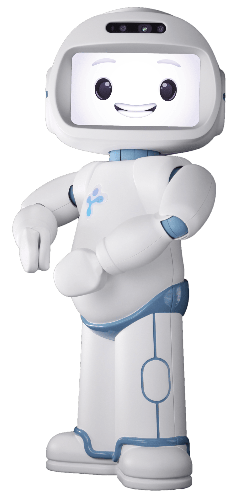

# QTrobot Social–Emotional Learning (SEL)

## Introduction
This project explores how robotics can support **Social–Emotional Learning (SEL)** by using QTrobot to guide children through interactive charades, role-playing scenarios, and reflective conversation. SEL focuses on helping children develop core emotional and interpersonal skills, including:

- Recognizing and naming emotions  
- Regulating feelings during challenging situations  
- Understanding others’ perspectives  
- Building empathy and cooperative behavior  
- Navigating social interactions and conflicts  

Traditional SEL instruction is often limited to worksheets, static prompts, or videos that lack the dynamic, embodied engagement children need. This system enhances SEL instruction by introducing **robot-mediated, play-based interaction**, where children learn social behaviors in a fun, physically engaged, and emotionally expressive way.

---

## Why QTrobot?
Although many educational robots exist, **QTrobot was intentionally selected** due to key advantages that directly support emotional development and child engagement.

### Expressive Facial Animations  
QTrobot features a full digital face capable of displaying nuanced emotional expressions—joy, sadness, fear, surprise, frustration, curiosity, and more. These animations allow children to clearly interpret and imitate emotional cues, which is essential in SEL activities involving charades, role-play, and perspective-taking.

### Non-Threatening, Child-Friendly Design  
QTrobot’s compact form factor, smooth animations, and cartoon-like face make it approachable and unintimidating. Compared to bulky service robots or rigid STEM robots, QTrobot creates a comfortable learning environment, especially for younger children or neurodiverse learners who may be sensitive to mechanical movement or physical size.

### Natural Interaction Patterns  
QTrobot can maintain eye contact, nod, gesture, and pause for responses, enabling natural conversational flow. These behaviors support turn-taking, emotional mirroring, and authentic social exchange—elements that are difficult to replicate with static media or non-expressive robots.

### Developer-Friendly & Modular  
QTrobot’s SDK allows rapid design of new SEL lessons without dealing with low-level hardware complexity. Because facial animations, gestures, speech, and expressive timing are all programmable, the system is ideal for iterative testing and curriculum development.

---

## Using Pickle Files for SEL Conversation Scripts
The system relies on **pickle (.pkl) files** to store and load scripted SEL lesson flows. Each pickle file contains:

- Robot dialogue lines  
- Emotion prompts  
- Charades actions  
- Role-play scenarios  
- Branching pathways depending on the child’s response  
- Reinforcement, praise, and reflective follow-up questions  

This approach provides several advantages:

### Modular & Scalable  
New SEL scenarios—such as coping with frustration, sharing, asking for help, or recognizing others’ emotions—can be added simply by creating new pickle files.

### Consistent Conversation Flow  
Pickled scripts ensure that lessons remain structured, repeatable, and easy to debug, while still allowing branching logic to make interactions feel personalized.

### Fast Prototyping for Research  
Educators, clinicians, or researchers can design and update SEL modules without modifying the core robot control code, enabling quick iteration in studies or classroom deployments.

---

## Activity Flow
A typical SEL session with QTrobot proceeds as follows:

1. **Load the SEL script** from a pickle file.  
2. **Robot introduces the lesson**, using expressive facial animations to model the target emotion.  
3. **Charades or Role-Play Round**  
   - QTrobot performs an emotion or scenario.  
   - The child responds with a facial expression, gesture, or verbal interpretation.  
4. **Adaptive Feedback**  
   - The robot uses pre-scripted branching to offer praise, clarification, or guidance depending on the child’s input.  
5. **Reflection & Real-World Transfer**  
   - The robot prompts the child with questions like:  
     - “When have you felt proud recently?”  
     - “What could we do if a friend looks sad?”  
6. **Session wrap-up**, reinforcing the lesson’s core SEL skill.

---

## Future Directions
Potential extensions for this system include:

- Voice emotion recognition for more adaptive branching  
- Gesture or pose recognition to evaluate charades responses  
- Personalized SEL profiles for individual learners  
- Longitudinal tracking for research on emotional development  
- Expansion into multi-child collaborative SEL activities  

---

This README introduces the purpose, motivation, and technical design of using QTrobot to deliver SEL content through charades and role-playing scenarios. Let me know if you want a version with a table of contents, badges, citations, or a demo section.
